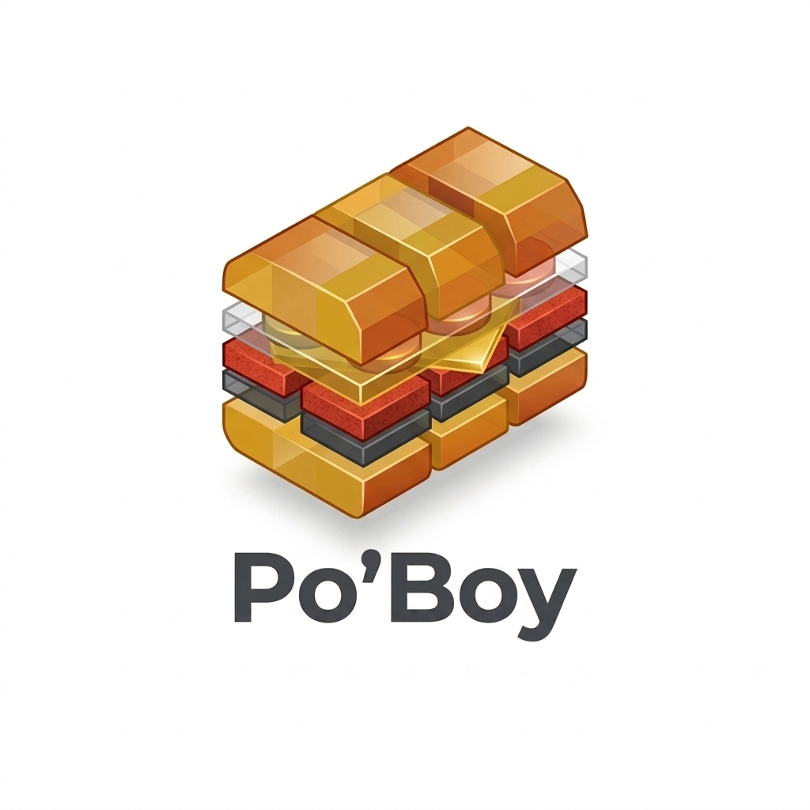

  

# Po'Boy Server Side Analytics 🥪⚡

> **A self-hosted analytics dashboard, visitor session logger, and marketing attribution server.**
> **GitHub Repository:** `github.com/dadelonglegs/poboy`

---

## 💡 What is Po'Boy Server Side Analytics?

Po'Boy Server Side Analytics is a lightweight, self-hosted analytics and marketing attribution suite. It runs on your own PHP or cPanel server, logs visitor sessions directly into your private database, and provides an interactive visual dashboard.

> 💡 **Looking for the Zero-Backend GTM Version?**
> If you only want a 1-click Google Tag Manager Data Layer without setting up a server or database, check out [**Po'Boy Data Layer**](https://github.com/dadelonglegs/poboy-data-layer)!

---

## 🔥 Key Features

* **Visual Analytics Dashboard (`dashboard.php`)**: A warm, easy-to-read dashboard featuring live visitor feeds, traffic source breakdowns, and search by user handle.
* **Interactive Heatmaps & Pin Map**: Toggle between Leaflet pin markers and density heatmaps to visualize where your visitors are located.
* **100% Private Data Ownership**: All visitor sessions, campaign parameters (`utm_source`, `gclid`, `fbclid`), and page views are saved directly into your own private `poboy.sqlite` database.
* **Raw CSV Exporters**: Export your raw attribution datasets into CSV format anytime for Excel, Google Sheets, or custom reporting.
* **Server Telemetry Blending**: Automatically captures client-side data alongside server headers like real IP addresses and Cloudflare GeoIP parameters.
* **Form Auto-Fill**: Automatically fills hidden attribution fields on web forms (like GoHighLevel, HubSpot, or Gravity Forms) when leads submit.

---

## 🛠️ Quick Installation (cPanel / PHP Server)

1. Download **`poboy-cpanel-turnkey.zip`** from this repository.
2. Upload the ZIP file to your website's root folder (`public_html/`) on your server.
3. Extract the ZIP file (creates `/public_html/poboy/` with pre-configured `.htaccess` security protection).
4. Access your dashboard at `https://yourdomain.com/poboy/dashboard.php` (Default Password: `PoBoyPass2026!`).
5. Include `poboy.js` on your website or fire it via GTM to begin logging hits!

---

## 🔗 Related Projects

* [**Po'Boy Data Layer**](https://github.com/dadelonglegs/poboy-data-layer) - The standalone, 1-click GTM Data Layer Publisher (Zero Backend).

---

## 📜 License
Open Source under the MIT License. Built with ❤️ by the Po'Boy team.
